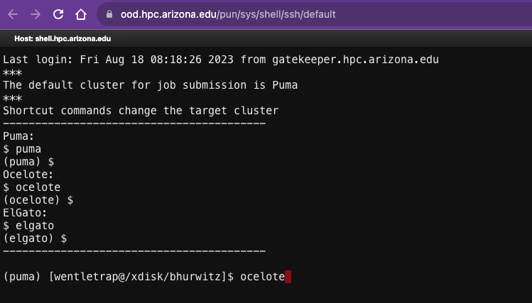

# Getting started on the HPC

## What is the HPC?

HPC is an acronym for "high-performance computing," and it generally means using a cluster of computers.  Students have access to several clusters (puma, ocelote, elgato) at the University of Arizona.  To use a cluster, you usually submit a batch job along with a description of the resources you need (e.g., memory, number of CPUs, number of nodes) to a scheduler that will start your job when the resources become available.  We will discuss schedulers, and in particular "SLURM" that is used on UA clusters, later in this class as we dive deeper into using the HPC and generating bioinformatics pipelines. For now, we will get started with using the command line via the HPC web-portal.

When you login to the HPC web-portal and ask for a "shell access" (see steps below), you are placed on the head node. **YOU ARE NOT ALLOWED TO RUN COMPUTE INTENSIVE JOBS ON THE HEAD NODE**. When we get to the point where we start running real bioinformatics jobs, you will do all of these steps on a compute node by sending out the job via the SLURM scheduler (more on that later!). Because we are getting started with simple Unix commands and scripting (that are not computationally intensive), we will login to the head node to do a few simple tasks.

## Steps for HPC access

To get started, please make sure that you have completed these two steps:

1. Enroll in Netid+ to access HPC systems. https://webauth.arizona.edu/netid-plus/

2. Create an HPC Account (if you don't already have one). https://account.arizona.edu

3. You should have received an invitation from me to access the HPC and join the bh_class group.


## Logging into the HPC Online Portal at the University of Arizona

1. Go to the HPC web-portal: https://ood.hpc.arizona.edu/pun/sys/dashboard and login with your UA net-id and password. 

2. On the top menu bar select "Clusters" and "_Shell access" from the pull-down list. 


3. A shell terminal will open for you in a new window. Type "ocelote" after prompt and hit enter. Now you will automatically be in your home directory.  



Once you login, the system will send you to your home directory. In my case, this is "/home/u20/bhurwitz". 

## Logging into the HPC via a Unix shell on your laptop

This section is optional. For this class, you will be able to do all of your work on the the HPC Online Portal at the University of Arizona. But, if you would like to do more advanced bioinformatics in the future you might want to consider accessing the HPC directly from your laptop. Here are the instructions: 

**Mac OSX** users can use the application called "terminal" on their laptop. You can find this under Applications->Utils->terminal. 

**Windows** users can either install windows subsystem for Linus on their laptop using this [protocol](https://www.protocols.io/view/install-wsl-and-vscode-on-windows-10-q26g78e1klwz/v1), or they can install Cygwin tools which is useful for just getting access to tools like "ssh" and "scp" to login to the HPC. 

Once you have a terminal window you can open a terminal and like this:

```
ssh <NetID>@hpc.arizona.edu
```

If all goes well, you should see something like this:

```
Last login: Fri Aug 18 08:18:23 2023 from c-71-226-40-183.hsd1.az.comcast.net
This is a bastion host used to access the rest of the RT/HPC environment.

Type "shell" to access the job submission hosts for all environments
-----------------------------------------

[bhurwitz@gatekeeper ~]$ 

```
 
The name of the machine should be  "gatekeeper.hpc.arizona.edu."  Verify this with the command "hostname<Enter>".  Use the command "shell" to get the following menu:

```
[bhurwitz@gatekeeper ~]$ shell
Last login: Fri Aug 18 11:26:24 2023 from ood.hpc.arizona.edu
***
The default cluster for job submission is Puma
***
Shortcut commands change the target cluster
-----------------------------------------
Puma:
$ puma
(puma) $
Ocelote:
$ ocelote
(ocelote) $
ElGato:
$ elgato
(elgato) $
-----------------------------------------
```

Make a selection from the menu to login to a head node for one of the clusters.

```
[bhurwitz@gatekeeper ~]$ ocelote
```

As of 2023, Puma is UA's newest cluster and is mainly used for research purposes. For instruction, we will use ocelote. 

If you would like to avoid the 2-factor authentication, then read the following:

https://www.protocols.io/view/ssh-to-UA-HPC-fm7bk9n