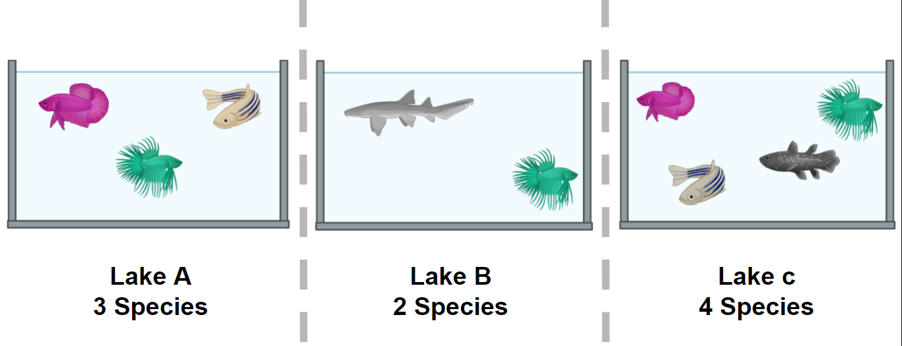
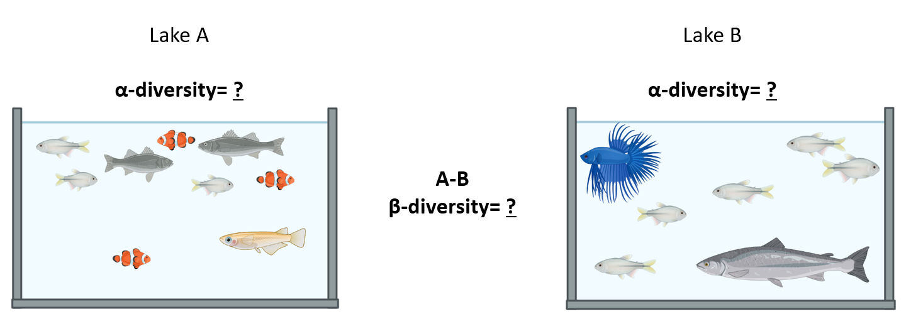

## Plunge into diversity

Species diversity, in its simplest definition, is the number of species in a particular area and their relative abundance (evenness).
Once we know the taxonomic composition of our metagenomes, we can do diversity analyses. 
Here we will discuss the two most used diversity metrics, α diversity (within one metagenome) and β (across metagenomes).   

- α Diversity: Can be represented only as richness (*, i.e.,* the number of different species in an environment), or it can be measured considering the
 abundance of the species in the environment as well (*i.e.,* the number of individuals of each species inside the environment). To measure α-diversity, we use indexes such as Shannon's, Simpson's, Chao1, etc. 

<em> Figure 1. Alpha diversity is calculated according to fish diversity in a pond. Here, alpha diversity is represented in its simplest way: Richness. <em/>
 
- β diversity is the difference (measured as distance) between two or more environments. 
It can be measured with metrics like Bray-Curtis dissimilarity, Jaccard distance, or UniFrac distance, to name a few. Each one 
of this measures are focused on a characteristic of the community (*e.g.,* Unifrac distance measures the phylogenetic relationship
between the species of the community).

In the next example, we will look at the α and the β components of the diversity of a 
dataset of fishes in three lakes. The most simple way to calculate the β-diversity 
is to calculate the distinct species between two lakes (sites). Let us take as an example the diversity between
Lake A and Lake B. The number of species in Lake A is 3. To this quantity, we will subtract the number of these species that are shared with the Lake 
B: 2. So the number of unique species in Lake A compared to Lake B is (3-2) = 1. To 
this number, we will sum the result of the same operations but now take Lake B as 
our reference site. In the end, the β diversity between Lake A and Lake B is 
(3-2) + (3-2) = 2. This process can be repeated, taking each pair of lakes as the 
focused sites.

<em> Figure 2. Alpha and beta diversity indexes of fishes in a pond.<em/>

If you want to read more about diversity, we recommend to you this [paper](https://link.springer.com/article/10.1007/s00442-010-1812-0) on 
the concept of diversity.

## α diversity  

|-------------------+-----------------------------------------------------------------------------------------------------------------|   
| Diversity Indices |                             Description                                                                         |   
|-------------------+-----------------------------------------------------------------------------------------------------------------|   
|      Shannon (H)  | Estimation of species richness and species evenness. More weight on richness.                                   |   
|-------------------+-----------------------------------------------------------------------------------------------------------------|   
|    Simpson's (D)  |Estimation of species richness and species evenness. More weigth on evenness.                                    |                              
|-------------------+-----------------------------------------------------------------------------------------------------------------|   
|     Chao1         | Abundance based on species represented by a single individual (singletons) and two individuals (doubletons).    |            
|-------------------+-----------------------------------------------------------------------------------------------------------------|   
 

- Shannon (H): 

| Variable             |  Definition   |     
:-------------------------:|:-------------------------:  
$ H = - \sum_{i=1}^{S} p_{i} \ln{p_{i}} $ | Definition
$ S $ | Number of OTUs 
$ p_{i} $ | The proportion of the community represented by OTU i

<!--  | Definition
 | Number of OTUs  
|  The proportion of the community represented by OTU i    -->

- Simpson's (D) 

| Variable             |  Definition |   
:-------------------------:|:-------------------------:  
$ D = \frac{1}{\sum_{i=1}^{S} p_{i}^{2}} $ | Definition
$ S $ | Total number of the species in the community
$ p_{i} $ | Proportion of community represented by OTU i
  
  
<!-- | Definition   
 | Total number of the species in the community   
 | Proportion of community represented by OTU i     -->
  
- Chao1  

| Variable             |  Definition |   
:-------------------------:|:-------------------------:  
$ S_{chao1} = S_{Obs} + \frac{F_{1} \times (F_{1} - 1)}{2 \times (F_{2} + 1)} $ | Count of singletons and doubletons respectively
$ F_{1}, F_{2} $ | Count of singletons and doubletons respectively
$ S_{chao1}=S_{Obs} $ | The number of observed species
  
  
<!-- | Definition  
|Count of singletons and doubletons respectively    
| The number of observed species   -->

 <!-- comment we use https://viereck.ch/latex-to-svg/ to convert from latex to SVG because Chao equation did not render correctly with GitHub math!-->

### β diversity  
Diversity β measures how different two or more communities are, either in their composition (richness) or in the abundance of the organisms that compose it (abundance). 
- Bray-Curtis dissimilarity: The difference in richness and abundance across environments (samples). Weight on abundance. Measures the differences 
from 0 (equal communities) to 1 (different communities)
- Jaccard distance: Based on the presence/absence of species (diversity). 
It goes from 0 (same species in the community) to 1 (no species in common)
- UniFrac: Measures the phylogenetic distance; how alike the trees in each community are. 
There are two types, without weights (diversity) and with weights (diversity and abundance)  

There are different ways to plot and show the results of such analysis. Among others, PCA, PCoA, or NMDS analysis are widely used.

> ## Exercise 1: Simple measure of alpha and beta diversities.
> In the next picture, there are two lakes with different fish species:
> <a href="../fig/03-08-03.png">
>   
>  </a> 
>  <em> Figure 3. <em/> 
>  
> Which of the options below is true for the alpha diversity in lakes A, B, and beta diversity between lakes A and B, respectively?
> 1. 4, 3, 1
> 2. 4, 3, 5
> 3. 9, 7, 16
>
> Please, paste your result on the collaborative document provided by instructors. 
> *Hic Sunt Leones!* (*Here be Lions!*)  
>

  
Solution

  <ul> 
Answer: 2. 4, 3, 5
**Alpha diversity** in this case, is the sum of different species. Lake **A** has **4** different species and lake **B** has **3** different species.
**Beta diversity** refers to the difference between lake A and lake B. If we use the formula in *Figure 2* we can see that to calculate beta diversity, we have to detect the number of species and the number of shared species in both lakes. There is only one shared species, so we have to subtract the number of shared species to the total species and sum the result. In this case, in lake A, we have 4 different species and one shared species with lake B (4-1)=3, and in lake B we have three species and one shared species with lake A (3-1)=2. If we add 3+2, the result is 5. 

  
> ## Discussion: Indexes of diversity  
> Why do you think we need different indexes to asses diversity? What index will you use to assess the impact of rare, low-abundance taxa?
> 

  
Solution

  <ul> 

It will be difficult (if not impossible) to take two communities and observe the same distribution of all members. This outcome is because 
there are a lot of **factors** affecting these lineages. Some of the **environmental factors** are temperature, pH, and nutrient concentration.
Also, the interactions of these populations, such as competence, inhibition of other populations, and growth speed, 
are an important driver of variation (**biotic factor**). A combination of the **factors mentioned above**, can interact to maintain some populations with low abundance **rare taxa** In order to have 
ways to assess hypotheses regarding which of these processes can be affecting the community, we use all these different indexes. Some emphasize the number of species and other the evenness of the OTUs. 

To assess the impact of low abundance lineages, one alpha diversity index widely used is the Chao1 index.

                             

